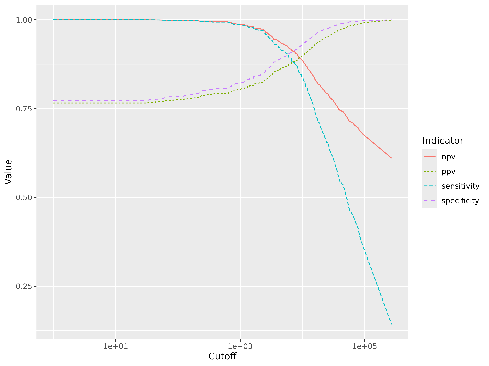
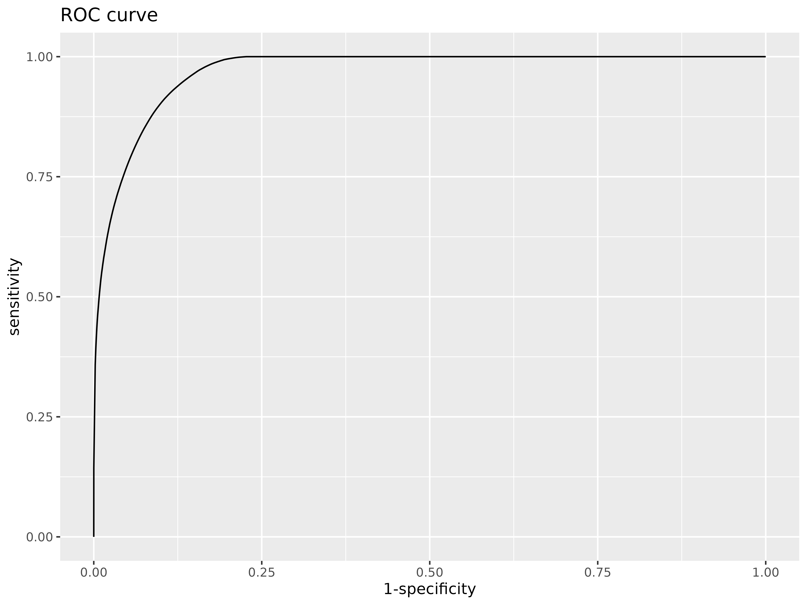

# Attributable fraction using a logitexponetial model

By John Aponte and Orvalho Augusto.

## Introduction

In malaria endemic areas, asymptomatic carriage of malaria parasites
occurs frequently and the detection of malaria parasites in blood films
from a febrile individual does not necessarily indicate clinical
malaria.

A case definition for symptomatic malaria that is used widely in endemic
areas requires the presence of fever or history of fever together with a
parasite density above a specific cutoff. If the parasite density is
equal or higher than the cutoff point, the fever is considered due to
malaria.

How to estimate what is the sensitivity and specificity of the cutoff
point in the classification of the fever, without knowing what is the
true value of the fevers due to malaria?

Using the attributable fraction, one can estimate the expected number of
true cases due to malaria and with the positive predictive value
associated with a given cutoff point, we can estimate the expected
number of true cases among the fever cases that have a parasite density
higher or equal than the selected cutoff point. Based on this values,
the rest of the 2x2 table can be completed and the sensitivity,
specificity and negative predictive value.

In order to estimate the attributable fraction and the positive
predictive value, we follow the method proposed by Smith et al. (1)
fitting a logistic exponential model.  
Here it is presented how to do it with the `afdx` package for the
R-software.

## Example using synthetic data

The data used in this example (malaria_df1) is a simulated data set as
seen frequently in malaria cross-sectionals where two main outcomes are
measured, the presence of fever or history of fever (fever column) and
the measured parasite density in parasites per $\mu l$ (density column).

``` r
library(afdx)
```

    #> 
    #> Attaching package: 'dplyr'
    #> The following objects are masked from 'package:stats':
    #> 
    #>     filter, lag
    #> The following objects are masked from 'package:base':
    #> 
    #>     intersect, setdiff, setequal, union
    #> 
    #> Attaching package: 'magrittr'
    #> The following object is masked from 'package:tidyr':
    #> 
    #>     extract
    #> 
    #> Attaching package: 'kableExtra'
    #> The following object is masked from 'package:dplyr':
    #> 
    #>     group_rows

| fever | density |
|------:|--------:|
|     1 |  475896 |
|     1 |   12008 |
|     0 |    1392 |
|     0 |    1664 |
|     0 |       0 |
|     1 |       0 |

head(malaria_df1) first 6 observations

In this simulation, there are 2000 observations, from which 785 have
fever or history of fever and 744 have a density of malaria greater than
0. A total of 437 have both fever and a malaria density higher than 0.

| k (category lower limit) | m (no fever) | n (fever) |
|:-------------------------|-------------:|----------:|
| 0                        |          908 |       348 |
| 1                        |           12 |         6 |
| 100                      |            8 |         4 |
| 200                      |           19 |         7 |
| 400                      |           37 |         8 |
| 800                      |           47 |        11 |
| 1600                     |           43 |        28 |
| 3200                     |           41 |        33 |
| 6400                     |           42 |        51 |
| 12800                    |           23 |        59 |
| 25600                    |           24 |        60 |
| 51200                    |           10 |        54 |
| 102400                   |            0 |        50 |
| 204800                   |            1 |        66 |

Distribution of fevers by density categories

## The logit exponential model

Smith et al (1) investigate different models to describe the risk of
fever due to malaria. Given that the association is not linear, the best
model found was a logit exponential model:

$logit\left( \pi_{i} \right) = \beta\left( x_{i} \right)^{\tau}$

where $\pi_{i}$ is the probability of fever for the observation $i$ and
$x_{i}$ is the parasite density for observation $i$.

The attributable fraction $\lambda$ is estimated as:

$\lambda = (1/N)\sum_{i}{\left( R_{i} - 1 \right)/R_{i}}$

where $N$ is the number of fever cases, and
$R_{i} = exp\left\lbrack \beta\left( x_{i} \right)^{\tau} \right\rbrack$

If a case of malaria is defined as a case of fever with a malaria
density equal greater than a cutoff $c$, $n_{c}$ is the number of fever
cases that accomplish that definition and the proportion of these
diagnosis cases that are attributable to malaria $\lambda_{c}$ is
estimated by

$\lambda_{c} = \left( 1/n_{c} \right)\sum_{i}d_{c,i}\left( R_{i} - 1 \right)/R_{i}$

where $d_{c,i}$ is and indicator with value 1 if that fever case
satisfies the malaria case definition and 0 otherwise

Sensitivity for the cuttof $c$ is defined then as:
$n_{c}\lambda_{c}/N\lambda$,

Specificity is defined as:
$1 - n_{c}\left( 1 - \lambda_{c} \right)/N(1 - \lambda)$

Predictive positive value as: $n_{c}\lambda_{c}/n_{c} = \lambda_{c}$

Negative predicted value as:
$\left( N(1 - \lambda) - n_{c}\left( 1 - \lambda_{c} \right) \right)/\left( N - n_{c} \right)$

For example, if 500 is selected as cutoff point, there are 420 cases of
fever with density greater or equal than 500 from a total of 785 fevers.
From the model, the estimated attributable fraction is 42.63% and the
proportion attributed to malaria for fevers equal or greater than 500 is
79.19%

The total number of true malaria cases is estimated as $N\lambda =$
334.7 and the number of true malaria cases in those that accomplish the
definition as $n_{c}\lambda_{c}$ = 332.6. The full 2x2 table can be
filled and the corresponding sensitivity, specificity and predictive
values calculated.

|                                         | True.Malaria | Other.aetiology | All |
|:----------------------------------------|-------------:|----------------:|----:|
| Malaria case (fever and density \> 500) |        332.6 |            87.4 | 420 |
| No case                                 |          2.1 |           362.9 | 365 |
| Total                                   |        334.7 |           365.0 | 785 |

Case definition with 500 as cutoff

## Estimating the sensitivity and specificity

The `adfx` provide functions that facilitate the fitting of the logit
exponential model and to estimate the sensitivity, specificity, positive
and negative predictive values for different cutoff points.

``` r

fit <- logitexp(malaria_df1$fever, malaria_df1$density)
fit
#>              coef          se           lb          ub          z        p.val
#> alpha -0.99141013 0.061181569 -1.111323803 -0.87149646 -16.204392 4.695061e-59
#> beta   0.01057824 0.006186711 -0.001547492  0.02270397   1.709832 8.729688e-02
#> tau    0.50528551 0.054336143  0.398788626  0.61178239   9.299252 1.414366e-20
#> = = = = = = = = = = 
#> AF:  0.4263406

senspec(fit, c(1,100,500,1000,2000,4000,8000,16000, 32000,54000,100000))
#>       cutoff sensitivity specificity       ppv       npv
#>  [1,]      1   1.0000000   0.7727793 0.7658522 1.0000000
#>  [2,]    100   0.9986640   0.7851102 0.7754762 0.9987369
#>  [3,]    500   0.9937948   0.8059183 0.7919063 0.9943103
#>  [4,]   1000   0.9861357   0.8224325 0.8049691 0.9876265
#>  [5,]   2000   0.9720090   0.8430224 0.8214885 0.9759178
#>  [6,]   4000   0.9250541   0.8858478 0.8576031 0.9408427
#>  [7,]   8000   0.8707224   0.9165290 0.8857480 0.9051178
#>  [8,]  16000   0.7372786   0.9594746 0.9311339 0.8309098
#>  [9,]  32000   0.5936829   0.9837722 0.9645255 0.7651379
#> [10,]  54000   0.4863330   0.9928155 0.9805100 0.7222734
#> [11,] 100000   0.3470470   0.9981097 0.9927245 0.6728613
```

## Graph of diagnostic characteristics for all cutoff points

The function
[`make_cutoffs()`](https://johnaponte.github.io/afdx/reference/make_cutoffs.md)
find the densities where there is change in the number of positives and
can be used to estimate the characteristics of all cutoff points

``` r
cutoffs <-  make_cutoffs(malaria_df1$fever, malaria_df1$density)
dxp <- senspec(fit, cutoffs[-1])
dxp %>%
  data.frame(.) %>%
  pivot_longer(-cutoff, names_to = "Indicator",values_to = "Value") %>%
  ggplot(aes(x = cutoff, y = Value, color = Indicator, linetype = Indicator)) +
  geom_line() +
  scale_x_log10("Cutoff")
```



## ROC curve

The receiver operative curve can be estimated from the sensitivity and
specificity values

``` r
rocdf <-dxp %>%
  data.frame(.) %>%
  ## add the corners
  bind_rows(
    data.frame(
      sensitivity= c(1,0),
      specificity= c(0,1)
    )
  ) %>%
  # generate the 1-specificity
  mutate(`1-specificity` = 1 - specificity) 

  # make the graph
  ggplot(rocdf, aes(x = `1-specificity`, y = sensitivity)) +
  geom_line()+
  ggtitle("ROC curve")
```



``` r
  
  # Estimate the area under the curve
  library(DescTools)
  AUC(rocdf$`1-specificity`, rocdf$sensitivity)
#> Warning in regularize.values(x, y, ties, missing(ties), na.rm = na.rm):
#> collapsing to unique 'x' values
#> [1] 0.9695134
```

## Bibliography

1.  Smith T, Schellenberg JA, Hayes R. Attributable fraction estimates
    and case definitions for malaria in endemic areas. Stat Med. 1994
    Nov 30;13(22):2345–58. DOI: 10.1002/sim.4780132206
